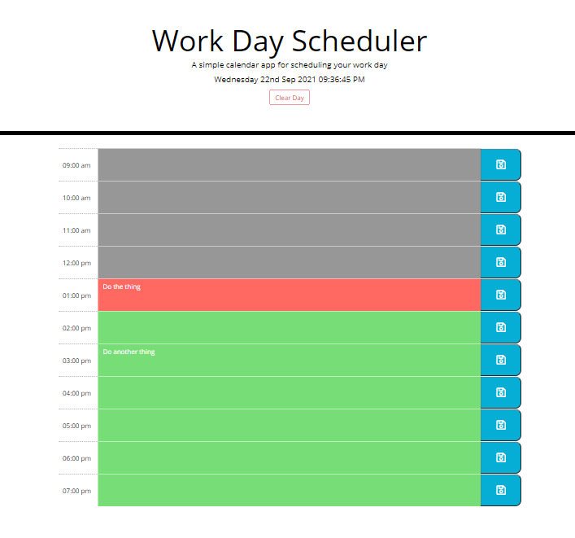

# Work Day Scheduler Starter Code
Jquery based work day scheduler

## Live Link
https://ajiaholiday.github.io/workday-scheduler/

## Description
An application that a user can use to add important events to a daily planner and manage their time effectively

## Usage
Current day is displayed at the top of the calendar and the user is presented with time blocks for standard business hours.

Each block is color coded to indicate whether it is in the past, present, or future. When the blocks are clicked the user can enter an event and save it by clicking the save button for that time block.

Events are saved when page is refreshed.

## Image of Application

## Contribution
Made with ❤️ by Ajia Holiday